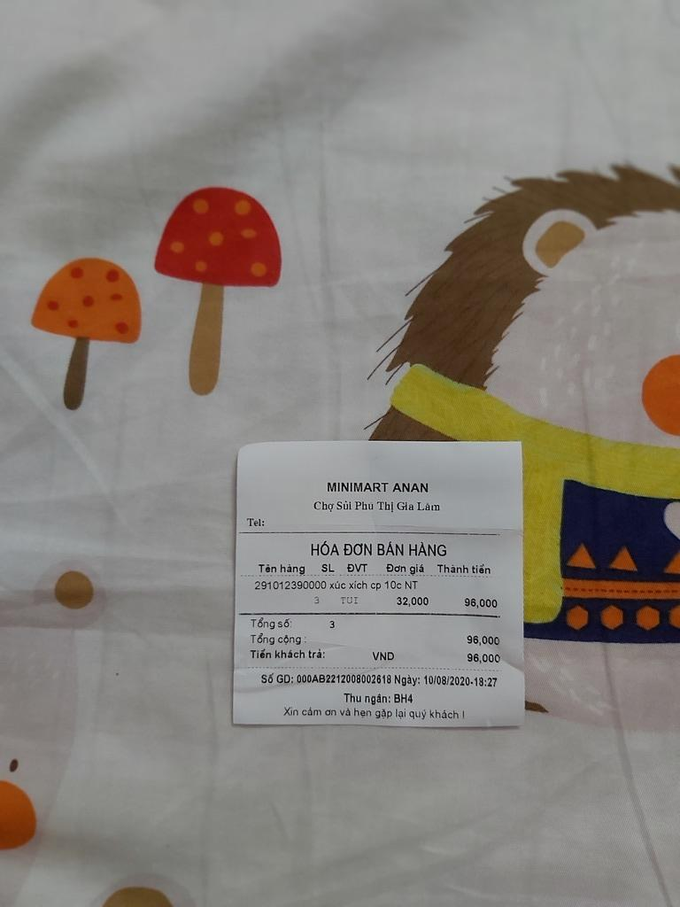
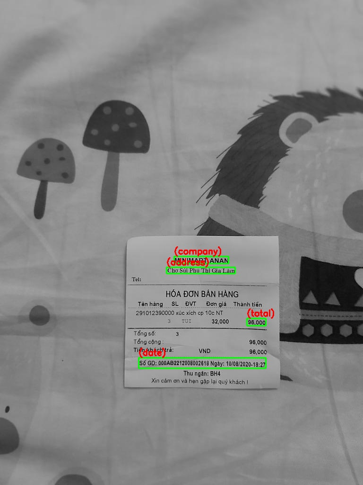

# Invoice Extraction System
Automatically extracts key information such as company name, date, address, and total amount from invoice images using OCR and Graph Neural Networks (GNN).


## Table of Contents

- [Installation](#installation)
- [Usage](#usage)
- [Demo](#demo)
- [License](#license)

## Installation

1. Clone the repository

```bash
git clone https://github.com/HieuNguyen2910/Invoice_Extraction
cd Invoice_Extraction
```

2. Create and activate Conda environment

```bash
conda create -n your_env python=3.8 -y
conda activate your_env
```

3. Install required dependencies
```bash
pip install -r requirements.txt
```

## Usage

```bash
python run.py
```

## Demo

Below is an example.

<p align="center">
  
  
</p>


